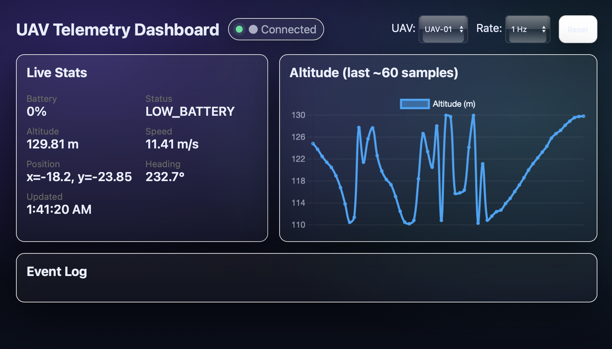

# UAV Telemetry Dashboard (Real-Time Monitoring System)

## Overview
This project simulates a real-time UAV telemetry system with a live dashboard for monitoring drone data.

It demonstrates how sensor data can be streamed, processed, and visualised in real time.

---

## Features
- Real-time telemetry simulation (altitude, speed, battery, position)
- Live dashboard using Flask and Chart.js
- Continuous data updates via API endpoints
- Structured data pipeline for monitoring systems

---

## Tech Stack
- Python (Flask)
- Chart.js (frontend visualisation)
- JSON / API-based data flow

---

## System Flow

Telemetry Simulator → Flask Backend → API → Dashboard (Charts)

---

## Future Work
- Integration with real UAV hardware
- Video + telemetry fusion
- Computer vision integration
